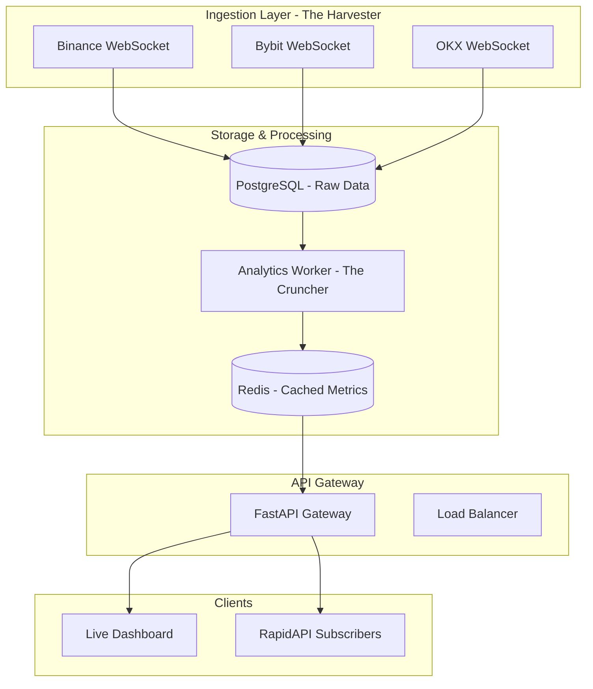

<div align="center">


# 🚀 CryptoFlow — Multi-Exchange Order Flow API

[](LICENSE)
[](https://www.python.org/downloads/)
[](https://fastapi.tiangolo.com/)
[](https://www.postgresql.org/)
[](https://redis.io/)
[](https://render.com)

**Real-time crypto derivatives analytics across Binance, Bybit, and OKX.**  
Sub-millisecond data delivery, cross-exchange aggregation, and institutional-grade metrics.

[**🌐 Live Dashboard**](https://crypto-open-flow-analysis-api.onrender.com/) • [**📖 API Documentation**](https://crypto-open-flow-analysis-api.onrender.com/docs) • [**⚡ RapidAPI Portal**](https://rapidapi.com/user/cryptoflow)

</div>

---

## 🔥 Key Features

-   **⚡ Low Latency**: Real-time trade and liquidation ingestion from 3+ major exchanges via WebSockets.
-   **📈 Advanced Analytics**: VWAP, CVD (Cumulative Volume Delta), Order Imbalance, and Liquidation Heatmaps.
-   **🐳 Whale Detection**: Real-time monitoring of large institutional trades and liquidations.
-   **🧠 Market Sentiment**: Composite sentiment scoring based on cross-exchange order flow.
-   **🧹 Cleaned Data**: Automated data retention and cleanup for optimized database performance.
-   **🔌 Easy Integration**: Fully compatible with RapidAPI for monetization and gated tier access.

---

## 🏗️ Architecture



---

## 🛠️ Tech Stack

-   **Language**: Python 3.10+ (AsyncIO/Aiohttp)
-   **Web Framework**: FastAPI (Uvicorn/Gunicorn)
-   **Database**: PostgreSQL 15+ (with `asyncpg`)
-   **Caching**: Redis (with `redis-py` async)
-   **Deployment**: Docker, Docker Compose, Render
-   **Integrations**: RapidAPI (Auth & Tiered Access)

---

## 🚀 Quick Start

### Local Development

1.  **Clone the Repository**
    ```bash
    git clone https://github.com/your-username/Crypto-Open-Flow-analysis-API.git
    cd Crypto-Open-Flow-analysis-API
    ```

2.  **Spin up Infrastructure** (Requires Docker)
    ```bash
    docker-compose up -d
    ```

3.  **Install Dependencies**
    ```bash
    pip install -r requirements.txt
    ```

4.  **Configure Environment**
    Copy `.env.example` to `.env` and fill in your connection strings.
    ```bash
    cp .env.example .env
    ```

5.  **Start Services** (Separate terminals recommended)
    ```bash
    # Terminal 1: Data Ingestion
    python ingestion_service.py

    # Terminal 2: Analytics Processing
    python analytics_worker.py

    # Terminal 3: API Gateway
    python api_gateway.py
    ```

6.  **Access the Dashboard**
    Open [http://localhost:8000](http://localhost:8000) in your browser.

---

## 📡 API Endpoints Reference

### 🟢 Free Tier (50 req/min)
| Endpoint | Method | Description |
| :--- | :--- | :--- |
| `/v1/metrics/live` | `GET` | Sub-millisecond cached price, VWAP, CVD, and imbalance. |
| `/v1/metrics/vwap` | `GET` | 24h Volume Weighted Average Price across exchanges. |
| `/v1/metrics/historical-cvd` | `GET` | Cumulative Volume Delta for a custom lookback window. |
| `/v1/data/liquidations` | `GET` | Recent liquidation events (Long/Short). |
| `/v1/symbols` | `GET` | List of currently tracked trading pairs. |
| `/v1/status` | `GET` | Health status and data freshness reports. |

### 🟡 Pro Tier ($14.99/mo | 500 req/min)
| Endpoint | Method | Description |
| :--- | :--- | :--- |
| `/v1/data/large-trades` | `GET` | Detect high-value trades (Whale trades) > $100k. |
| `/v1/analysis/order-imbalance`| `GET` | Real-time buy/sell pressure ratio analysis. |
| `/v1/data/ohlcv` | `GET` | Customizable OHLCV candles (1m, 5m, 15m, 1h). |
| `/v1/data/funding-rates` | `GET` | Current funding rates per exchange. |

### 🔴 Ultra Tier ($49.99/mo | 2,000 req/min)
| Endpoint | Method | Description |
| :--- | :--- | :--- |
| `/v1/data/open-interest` | `GET` | Live Open Interest per exchange with delta change. |
| `/v1/analysis/liquidation-heatmap`| `GET` | Liquidation intensity by price level. |
| `/v1/analysis/sentiment` | `GET` | Composite market sentiment score (-100 to +100). |
| `/v1/analysis/cross-exchange` | `GET` | Comparative order flow across all venues. |
| `/v1/data/funding-history` | `GET` | Historical funding rate trends (24h+). |

---

## ⚙️ Environment Variables

> [!WARNING]
> Ensure `RAPIDAPI_PROXY_SECRET` is set in production to prevent unauthorized access.

| Variable | Default | Description |
| :--- | :--- | :--- |
| `DATABASE_URL` | `postgresql://...` | Connection string for PostgreSQL. |
| `REDIS_URL` | `redis://...` | Connection string for Redis. |
| `SYMBOLS` | `BTCUSDT,ETHUSDT`| Comma-separated pairs to track. |
| `ENABLED_EXCHANGES` | `binance,bybit,okx`| Active exchange connectors. |
| `DATA_RETENTION_DAYS`| `30` | Number of days to keep raw trade data. |
| `BATCH_FLUSH_INTERVAL`| `0.5` | DB sync frequency (seconds). |

---

## 📜 License

**Proprietary.** All rights reserved.  
Contact the maintainer for licensing inquiries or commercial use.

---

<div align="center">
Built with ❤️ for the Crypto Trading Community
</div>